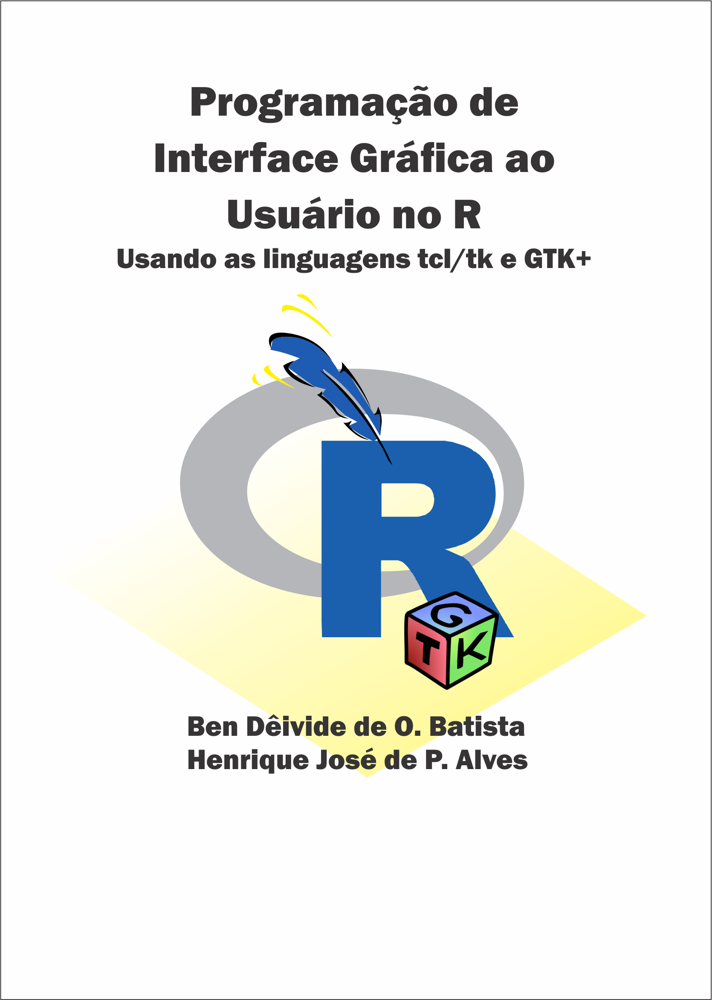

<!-- README.md is generated from README.Rmd. Please edit that file -->

# <i class="fas fa-box-open"></i> meupacoter 

<!-- badges: start -->

<!-- badges: end -->

O objetivo do pacote
[meupacoter](https://bendeivide.github.io/meupacoter/) é ensinar a como
desenvolver pacotes R usando o [RStudio](http://rstudio.com).
Mostraremos muitas ferramentas úteis para o desenvolvimento de pacotes,
como desenvolver insterfaces gráficas ao usuário, a internacionalização
de pacotes para outros idiomas, criação de websites, criação de
vignettes, e muito mais.

## <i class="fas fa-map-marker-alt"></i> Onde [meupacoter](https://bendeivide.github.io/meupacoter/) foi apresentado?

O [meupacoter](https://bendeivide.github.io/meupacoter/) já foi
apresentado em palestras, seminários e minicursos sobre desenvolvimento
de pacotes. Contudo, só a partir de 24 de novembro de 2020 é que o
pacote ficou disponível no [repositório
Github](http:://github.com/bendeivide/meupacoter/).

Vejam alguns locais que o
[meupacoter](https://github.com/bendeivide/meupacoter/) já foi
apresentado:

| Data       | Local                               | Tema da apresentação                                                                |
| ---------- | ----------------------------------- | ----------------------------------------------------------------------------------- |
| 08/12/2020 | UFJF - Juiz de Fora/MG (Brasil)     | Semana da Estatística                                                               |
| 20/08/2020 | UFSJ - São João del-Rei/MG (Brasil) | [Seminário: Desenvolvimento de pacotes em R](https://ufsj.edu.br/demat/scm2020.php) |
| 26/08/2013 | UFLA - Lavras/MG (Brasil)           | [Seminário: Desenvolvimento de pacotes em R](http://www.des.ufla.br/)               |
| 05/02/2013 | UFLA - Lavras/MG (Brasil)           | [Minicurso: Desenvolvimento de pacotes em R](http://www.des.ufla.br/)               |

## <i class="fas fa-arrow-alt-circle-down"></i> Instalação

O [meupacoter](https://bendeivide.github.io/meupacoter/) ainda não está
disponível no [CRAN](https://CRAN.R-project.org).

<!--
You can install the released version of meupacoter from [CRAN](https://CRAN.R-project.org) with:

``` r
install.packages("meupacoter")
```
-->

Mas a versão em desenvolvimento no [GitHub](https://github.com/) pode
ser instado como segue:

``` r
# install.packages("devtools")
devtools::install_github("bendeivide/meupacoter")
```

## <i class="fas fa-cubes"></i> Exemplos de pacotes que podem ser estudados

Estamos em fase de desenvolvimento de alguns pacotes que já apresentam
algumas opções avançadas, tais como, interface gráfica ao usuário,
internacionalização, dentre outras opções. Seguem os pacotes via GitHub:

  - [midrangeMCP](http://bendeivide.github.io/midrangeMCP)
  - [statscience](https://bendeivide.github.io/statscience/)
  - [MCPtests](https://github.com/bendeivide/MCPtests)

Nossos pacotes sobre o [CRAN](https://CRAN.R-project.org):

  - [SMR](http://cran.r-project.org/package=SMR)
  - [midrangeMCP](http://cran.r-project.org/package=midrangeMCP)
  - [TVMM](http://cran.r-project.org/package=TVMM)
  - [cppcor](http://cran.r-project.org/package=cppcor)
  - [MCPtests](http://cran.r-project.org/package=MCPtests)

## <i class="fas fa-book"></i> Livros em desenvolvimento

O estudo em desenvolvimento de pacotes R tem nos gerado esforços para
repassarmos essas experiências. Isso porque em algumas situações, a
solução de alguns problemas não foram encontrados facilmente. Diante
disso, apresentamos alguns projetos de livros em desenvolvimento, ainda
não disponíveis.

<p align="center">




</p>
