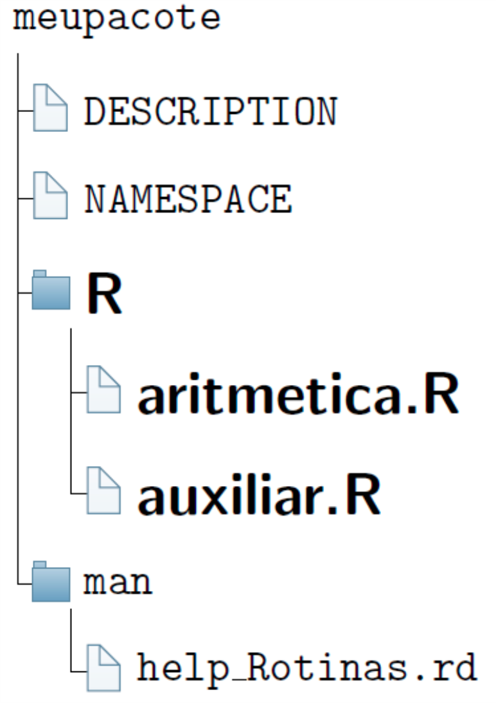
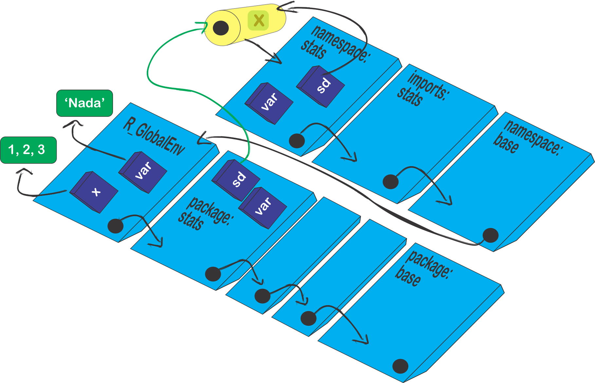

```{r, include = FALSE}
knitr::opts_chunk$set(
  collapse = TRUE,
  comment = "#>"
)
```

## Introdução

Os arquivos do pacote, mencionados na Subseção [Esqueleto básico de um pacote R](construindo_pacote.html#sec-esqueleto), serão agora editados, uma vez que o [RStudio](https://rstudio.com/) constroi apenas um modelo para os arquivos.

Inicialmente, iremos apresentar duas rotinas para a construção do pacote:

* [aritmetica.R](https://github.com/bendeivide/meupacote/blob/main/R/aritmetica.R)

```{r aritmetica, eval = FALSE}
# Sem edição do pacote `roxygen2`
aritmetica <- function (a, b, op) {
  # op: divisi, multi, soma, subtra
  if (op == "divisi") x <- divisi(a, b)
  if (op == "multi") x <- multi(a,b)
  if (op == "soma") x <- soma(a,b)
  if (op == "subtra") x <- subtra(a,b)
  return(x)
}
```

* [auxiliar.R](https://github.com/bendeivide/meupacote/blob/main/R/auxiliar.R)

```{r auxiliar, eval=FALSE}
# Funcoes auxiliares

# Soma
soma <- function (a, b) {
          calculo <- a + b
          return(calculo)
}

#Subtracao
subtra <- function (a, b) {
            calculo <- a - b
            return(calculo)
}

# Multiplicacao
multi <- function (a, b) {
           calculo <- a * b
           return(calculo)
}

# Divisao
divisi <- function (a, b) {
            calculo <- a / b
            return(calculo)
}

```

A ideia dessas funções é muito simples, apresentar as quatro operações básicas entre dois números. Claro que não faz sentido desenvolver um pacote para algo trivial. Contudo, o enfoque é entender as peculiaridades do processo de construção de um pacote.

E um passo muito interessante ocorre sobre essas duas rotinas, pois uma iremos exportar e a outra não. Isto significa que ao carregar o pacote, funções do pacote que não são exportáveis, tornam-se invisíveis, podendo ser observadas apenas abrindo o arquivo **nome_pacote.tar.gz**. Às vezes, desejamos omitir algumas funções que são auxiliares para o nosso código. Isso significa, que elas sozinhas não terão utilidades. Dessa forma, não se faz necessário apresentá-las. Em outras situações, o que fazemos é omitir ou dificultar a visualização de determinadas funções, por algum interesse, mesmo sabendo que o código é aberto. 

No nosso caso, apenas a função `aritmetica` será exportável. Perceba, que o cerne do pacote está na rotina  [auxiliar.R](https://github.com/bendeivide/meupacote/blob/main/R/auxiliar.R), pois é nela que temos as quatro funções para as operações aritméticas.  Veremos mais a frente como definir a exportação de funções em um pacote.

## Atualizando as funções do pacote

Como já falado na Seção [Construindo o esqueleto de um pacote R](construindo_pacote.html), o subdiretório *R/* é o local para armazenar as rotinas do pacote. Dessa forma, vamos fazer as atualizações retirando os arquivos *.R* criados pelo [RStudio](https://rstudio.com/), e inserindo as rotinas do pacote  ([aritmetica.R](https://github.com/bendeivide/meupacote/blob/main/R/aritmetica.R) e [auxiliar.R](https://github.com/bendeivide/meupacote/blob/main/R/auxiliar.R)). Lembre-se das [boas práticas de como escrever um código R](introd_pkg.html#goodpractice).

<p align="center">

</p>

## Editando o arquivo *DESCRIPTION*

Quando nós [criamos um projeto de pacote](construindo_pacote.html#building_rpack) usando o [RStudio](https://rstudio.com/), um arquivo chamado *DESCRIPTION* é criado no diretório do projeto do pacote. Talvez um dos mais importantes arquivos do pacote, pois esse arquivo contém os metadados sobre as característica do pacote, como o seu nome, título, versão, autor, descrição, licença, dentre outras opções. 

A estrutura básica é que cada linha se inicia com o nome do campo seguido de ":", posteriormente, se insere a atribuída a esse campo. Segundo o manual [Writing R extensions](https://cran.r-project.org/doc/manuals/r-devel/R-exts.html#The-DESCRIPTION-file), os campos `Package`, `Version`, `Licence`, `Description`, `Title`, `Author` e `Mantainer` são obrigatórios . Todos os outros campos são opcionais. Todo o *DESCRIPTION* deve ser escrito em ASCII, isto é, caracteres sendo letras e números. Para utilizar caracteres diferentes, deve ser acrescentado o campo `Encoding` e informar o tipo de codificação. No pacote [meupacoter](https://bendeivide.github.io/meupacoter/), por exemplo, foi utilizado `Encoding: UTF-8`. 

```{description, eval = FALSE}
Package: nome do pacote
Title: O que o pacote faz (Em uma linha)
Version: 0.0.0.9000
Authors@R: 
    person(given = "First",
           family = "Last",
           role = c("aut", "cre"),
           email = "first.last@example.com",
           comment = c(ORCID = "YOUR-ORCID-ID"))
Maintainer: Nome e email do mantenedor do pacote
Description: O que o pacote faz (Em um parágrafo).
License: Qual a licença que você usa
```


Iremos discutir a ideia sobre alguns desses campos a seguir.

### Nome do pacote

A discução sobre o nome do pacote foi realizado na subseção [Escolha do nome e logo do pacote](introd_pkg.html#name_logo_pkg). O campo para o nome é `Package`, com as seguintes características ([Writing R extensions](https://cran.r-project.org/doc/manuals/r-devel/R-exts.html#The-DESCRIPTION-file)):

* deve conter somente letras, números e ponto;
* ter pelo menos dois caracteres;
* começar com uma letra
* não terminar com um ponto. 

Esse campo não deve ser utilizado para explicar o que o pacote faz. Para isso use o campo `Description`.

### Título do pacote

O campo para o título do pacote é `Title`. Nele deve conter uma pequena descrição do pacote em uma única linha. Seguem alguns requisitos ([Writing R extensions](https://cran.r-project.org/doc/manuals/r-devel/R-exts.html#The-DESCRIPTION-file)):
 
* Não use marcações for do pacrão ASCII;
* Não finalize o título com um ponto;
* Não repita o nome do pacote no título;
* Se usar a referência de outros pacotes no título, use aspas simples ('<outrs_pacotes>'), se referenciar livros, aspas duplas ("nome_livros");
* Geralmente limitado em 65 caracteres.

### Controle de versão do pacote

O campo responsável pela versão do pacote é `Version`. Deve ser uma sequência de ao menos dois números não negativos inteiros separados por um ponto ('.') ou traço ('-'). Por exemplo, 1.1 e 0.9.1-10 são versões válidas, mas essas versões 2 ou 2.0-devel não são válidas. No livro [R packages](https://combine-australia.github.io/r-pkg-dev/versioning.html), temos uma descrição detalhada e abordada a seguir. Usaremos também uma abordagem feita pelo [COMBINE](http://combine.org.au), pelo material [R package workshop](https://combine-australia.github.io/r-pkg-dev/).

Podemos dizer que a estrutura do controle de versão é formado por uma sequência de quatro dígitos: `<maior>.<menor>.<trecho>.<desenvolvimento>`. Vejamos,
```{r versao, eval = TRUE}
numeric_version("1.9") == numeric_version("1.9.0")
numeric_version("1.9") == numeric_version("1.9.0.0")
```
Isso significa dizer, se usarmos ao menos dois dígitos, os outros dígitos serão completados por zero (*default*). Vejamos o que significa cada dígito:

* Dígito `<maior>`: esse dígito é alterado quando o pacote passa por uma mudança significativa na atualização;
* Dígito `<menor>`: esse dígito é alterado quando ocorre alguma funcionalidade foi adicionada ao pacote, como criação de funções, atualizações de funções com os códigos existentes, etc;
* Dígito `<trecho>`: esse dígito se altera quando ocorre correções de erros (`bugs`) no pacote, mas não é acrescido nada de novo. Uma forma interessante de encontrar esses erros é criar uma página de problemas do pacote, e à medida que ocorre a experiência do usário com o pacote, alguns problemas podem ocorrer que não eram previstos pelo desenvolvedor. Dessa forma, esses problemas podem ser postados nessa página específica. No Github há uma aba chamada *issues* nos repositórios criados, que é específico para isso, e o link dessa página pode ser inserido no campo `BugReports` no arquivo *DESCRIPTION*;
* Dígito `<desenvolvimento>`: o dígito 9000 é utilizado quando o pacote está em desenvolvimento. Com essa codigifcação, podemos esperar mudanças muito rápidas no pacote.

Caso deseje alterar algum dos dígitos, o desenvolvedor pode alterar diretamente no arquivo *DESCRPTION*, ou usando (Exemplo realizado para o [meupacoter](https://bendeivide.github.io/meupacoter/)):
```{r altera_versao, eval = FALSE}
usethis::use_version()
Setting active project to '~/meupacoter'
There are uncommitted changes. Do you want to proceed anyway?

1: Negative
2: Nope
3: Yup

Selection: "<Escolhe uma das opções e digita: 1, 2 ou 3>"
Current version is 0.0.0.9000.
Which part to increment? (0 to exit) 

1: major --> 1.0.0
2: minor --> 0.1.0
3: patch --> 0.0.1
4:   dev --> 0.0.0.9001

Selection: "<Escolhe uma das opções e digita: 1, 2 ou 3>"
```

A primeira versão de um pacote que inicia o seu desenvolvimento é 0.0.0.9000.

Nós, particularmente, estamos usando a seguinte estratégia para o [meupacoter](https://bendeivide.github.io/meupacoter/), como o pacote está em desenvolvimento, e sua finalidade é ensinar a desenvolver pacotes, o que pretendemos é criar páginas web com o passo-a-passo. Assim, estamos usando o quarto dígito `9000`. Os acréscimos realizados sob o [GitHub](http://github.com), que levam em consideração as páginas web, estão alterando o dígito menor, porque a primeira versão quando for submetida ao [CRAN](http://cran.r-project.org), será `1.0.0`, de modo que o pacote estará estável, não haverá mais alterações no dígito maior (assim, esperamos!), apenas nos demais.

De fato, as sugestões dos números de versão mencionadas por [R packages](https://combine-australia.github.io/r-pkg-dev/versioning.html) e [R package workshop](https://combine-australia.github.io/r-pkg-dev/) ocorrem a cada alteração lançada ao [CRAN](http://cran.r-project.org), e o controle dos três dígitos para a versão, realmente é interessante. Entretanto, achamod que seguir a ideia dos três dígitos é interessante, mas não que isso fique martirzando a sua cabeça, uma vez que nos manuais do [CRAN](http://cran.r-project.org) não há condições restritivas para essas escolhas. Caso deseje detalhes, é só consultar [Writing R extensions, DESCRIPTION](https://cran.r-project.org/doc/manuals/r-devel/R-exts.html#The-DESCRIPTION-file).

### Autor e Mantenedor

Os campos responsáveis pela criação do pacote, de forma direta ou indireta, são `Autor` ou `Authors@R` e `Mantainer`. Começando pelo último, este campo representa a pessoa responsável por manter o pacote sobre o [CRAN](http://cran.r-project.org), correção, atualização, etc. Apenas ele tem esse poder e deve ser uma pessoa e não uma empresa, de modo que seja válido enquanto o pacote estiver disponível no [CRAN](http://cran.r-project.org). O campo `Autor` ou `Authors@R` representa as pessoas que desenvolveram o pacote. O que diferencia esses dois campos é a forma de inserir as informações. Para o campo `Authors@R`, ainda pode ser inserido funções adicionais aos autores, algo como especifícações do que cada autor contribuiu de fato ao desenvolvimento do pacote. Apresentamos quatro funções importantes:

* `aut`: autores que fizeram contribuições significativas ao pacote;
* `cre`: mantenedor do pacote que estará responsável para resolver possíveis problemas do pacote;
* `ctb`: desenvolvedores que fizeram contribuições menores;
* `cph`: detentor dos direitos autorais, quando a autoria não é do autor, geralmente uma empresa.

Se desejar uma especificação mais detalhada sobre o seu papel como desenvolvedor, consulte mais siglas em [full list of roles](https://www.loc.gov/marc/relators/relaterm.html)

A forma básica de inserir os dados no campo `Mantainer` o primeiro e o último nome, seguido do email entre ("< >"), por exemplo, `Mantainer: Ben Deivide <ben.deivide@gmail.com>`. 

Para inserir as informações no campo `Author`, basta digitar o nome dos autores separados por vírgula, por exemplo: `Author: Ben Deivide, Daniel Furtado, Diego Arthur`.

Por fim, como já falado acima, uma descrição mais completa pode ser usando o campo `Authors@R`, inserindo a especificação de cada autor ao desenvolvimento do pacote, usando as siglas acima. E ainda mais, não será necessário inserir no arquivo *DESCRIPTION*  o campo `Mantainer`. Veremos a seguir, um exemplo do pacote [midrangeMCP](https://bendeivide.github.io/midrangeMCP/):
```{description_author}
Authors@R: c(
    person(given = "Ben", 
           family = "Deivide", 
           email = "ben.deivide@ufsj.edu.br", 
           role = c("aut", "cre"), 
           comment = c(ORCID = '0000-0001-7019-8794')),
    person(given = "Daniel", 
           family = "Furtado", 
           email = "danielff@dex.ufla.br", 
           role = "aut",
           comment = c(ORCID = '0000-0002-4371-5239')),
    person(given = "Diego", 
           family = "Arthur", 
           email = "digo.arthur@hotmail.com", 
           role = "ctb"))
```
Dentro do campo `Authors@R`, inserimos para cada desenvolvedor, uma descrição dentro da função chamada `person`, do pacote `utils`, veja o resultado da sua execução:

```{r person, eval = TRUE}
 person(given = "Ben", 
           family = "Deivide", 
           email = "ben.deivide@ufsj.edu.br", 
           role = c("aut", "cre"), 
           comment = c(ORCID = '0000-0001-7019-8794'))
```
Na função `person` o primeiro argumento representa o primeiro nome do autor (`given`) e o segundo (`family`), o último nome. Posteriormente, temos o argumento para o email (`email`), e em seguida, o argumento para identificar a especificação do autor para o pacote (argumento `role`). Por fim, acrescentamos em `comment`, uma informação adicional que foi o [ORCID](https://orcid.org/) dos respectivos autores. Percebam pelas regras atribuídas aos desenvolvedores que Ben Deivide e Daniel Furtado são autores (regra `'aut'`), e o primeiro é também mantenedor (regra `'cre'`). No caso de Diego Arthur, como o seu desenvolvimento teve menores contribuições ao pacote, a regra foi `'ctb'`. Dessa forma, não será necessário inserir o campo `Mantainer`.

### Descrição

O campo responsável no arquivo *DESCRIPTION* para descrever e detalhar o que faz o pacote é `Description`. Deve conter apenas um parágrafo. Vejamos mais algumas informações ([R packages](https://combine-australia.github.io/r-pkg-dev/versioning.html)):

* Evite iniciar a descrição com o nome do pacote, ao invés, use *Esse pacote...* ou algo similar;
* Quando a descrição estiver em mais de uma linha, cada linha deve conter no máximo 80 caracteres, e a partir da segunda linha, dê 4 espaços para iniciá-la;
* Assim como no campo `Title`, devemos usar aspas duplas ("texto") para referenciar livros, artigos, aspas simples para palavras que não estão em inglês, incluindo nomes de pacotes, softwares externos, etc.
* Para utilização de sites, use aspas simples com colchetes angulares, isto é, ‘<https://www.r-project.org>’.

Vejamos um exemplo do campo `Description` no arquivo *DESCRIPTION* do pacote [midrangeMCP](https://cran.r-project.org/web/packages/gnomeGUI/index.html):

```{}
Description: Apply tests of multiple comparisons based
    on studentized 'midrange' and 'range' distributions. 
    The tests are: Tukey Midrange ('TM' test),
    Student-Newman-Keuls Midrange ('SNKM' test), 
    Means Grouping Midrange ('MGM' test) and 
    Means Grouping Range ('MGR' test). The articles of these 
    tests are in the submission phase, and we will soon update 
    the references.
```

### Campos opcionais ao *DESCRIPTION*

Alguns campos adicionais são interessantes e deixamos na tabela abaixo  para consulta ([Writing R extensions, DESCRIPTION](https://cran.r-project.org/doc/manuals/r-devel/R-exts.html#The-DESCRIPTION-file)).

|Campos opcionais| Finalidade|
|----------------|-----------|
| `Data`         | Insere a data atualizada para submissão ao [CRAN](http://cran.r-project.org). Essa data é preferível deixar não ser colocada. Já tivemos rejeição de pacotes, simplesmente porque a data estava desatualizada. |
| `Depends`      | Campo utilizado para fornecer uma lista de pacotes, separados por vírgula, que o seu pacote depende. Esses pacotes serão também instalados quando solicitar o pacote de interesse pela função `install.packages`. Para mais detalhes, ver Subseçções [Campo *Depends*](conf_files_pkg.html#campo-depends) e [Uso de pacotes dependentes em *Imports* ou *Depends*?](conf_files_pkg.html#subsec-depimp).  |
| `Imports`      | Esse campo é utilizado para listar pacotes que são inseridos no [NAMESPACE](conf_files_pkg.html#sec-namespace). Isso significa que ao importarmos funções de outros pacotes que serão necessários ao nosso pacote, poderão ser utilizados sem precisarmos anexar estes pacotes de origem destas funções. Funções que usamos os operadores "::" ou ":::", também deverão ser listados aqui, ou nos campos `Suggests` ou `Enhances`. Para mais detalhes, ver Subseção [Uso de pacotes dependentes em *Imports* ou *Depends*?](conf_files_pkg.html#subsec-depimp). |
| `Suggests`      | Esse campo usa a mesma sintaxe do campo `Depends` e lista os pacotes que não são necessariamente necessários. Geralmente são pacotes utilizados nos exemplos de documentação de ajuda do pacote (arquivos do subdiretório `man/~.Rd`), ou na descrição de um conjunto de dados inseridos no pacote; no auxílio dos tutoriais (*vignettes*), dentre outras situações, que não impede o bom funcionamento do pacote.      |
| `Enhances`| Campo que lista os pacotes que forncem um aprimoramento do pacote em questão, por exemplo, forncendo métodos para as classes desses pacotes ou maneiras de manipular objetos.|
| `SystemRequirements`       | Dependências externas ao sistema [R](http://r-project.org) devem ser listadas no campo `SystemRequirements`, sendo detalhados essa integração no arquivo *README*. Para mais detalhes veja a Subseção [Uso do campo *SystemRequirement*](conf_files_pkg.html#ext_files_r).        |
| `NeedsCompilation`   | Campo utilizado para identíficar códigos que necessitam de compilação antes da instalação do pacote. Nesse caso o campo deve assumir `NeedsCompilation:yes`. Caso contrário, se o pacote ao ser instalado em quaiquer plataformas e não precisar ser instalado ferramentas adicionais, use `NeedsCompilation:no`, esse é o padrão. Geralmente quando usamos o comando `R CMD build` para a compilação do pacote binário para a utilização no SO Windows, e esse pacote apresenta o subdiretório `src`, usamos `NeedsCompilation:yes`. Quando usamos esse tipo de compilação, não há no arquivo *DESCRIPTION* o campo `Authors@R`, por exemplo, e sim, os campos `Mantainer` e `Author`.|
|       `License`         |        [Licença R](https://www.r-project.org/Licenses/), [Writing R extensions,DESCRIPTION](https://cran.r-project.org/doc/manuals/r-devel/R-exts.html#The-DESCRIPTION-file)|
|  `Copyright`   |  Usado quando o detentor dos direitos autorais não forem os autores. Se desejar, poderá inserir um arquivo (`COPYRIGHTS`) no pacote para um maior detalhamento. O convencional é usar o subdiretório `inst`, isto é, `inst/COPYRIGHTS`.Ver Seção [Subdiretórios adicionais](subdir_add.html#subdir_inst).     |
| `Additional_repositories`      |    O campo `Additional_repositories` é uma lista separada por vírgulas de URLs de repositório onde os pacotes nomeados em outros campos podem ser encontrados.       |
|  `LinkingTo`   |   Um pacote que deseja fazer uso de arquivos de cabeçalho em outros pacotes para compilar seu código *C/C++*  precisa declará-los como uma lista separada por vírgulas no campo `LinkingTo` no arquivo *DESCRIPTION*. Para detalhes veja o Git do pacote [BH](https://github.com/eddelbuettel/bh#bh-boost-headers-for-r).|
|   `BugReports` |   Campo que apresenta uma única URL específica para se reportar a erros do pacote. Uma das opções de hospedagem é via Github, na seção *issues*, veja a seção [Criar uma website para o pacote](construindo_website.html). Caso deseje especificar outro email para os possíveis erros, use o campo `Contact` para isso.  |
|   `URL`        | Campo para especificas uma listas de URLs separados por vírgula, que hoespeda a sua página pessoal ou a página do pacote. Uma das opções de hospedagem é via Github. Veja a seção [Criar uma website para o pacote](construindo_website.html).     |
|    `LazyData`  |   Campo lógico (`TRUE` ou `FALSE`), para para informar que existe um conjunto dados diponíveis no pacote para utilização.   |
|     `KeepSource`  |  O campo lógico `KeepSource` controla se o código do pacote é originado usando `keep.source = TRUE` ou `FALSE`: pode ser necessário excepcionalmente para um pacote projetado para ser sempre usado com `keep.source = TRUE`. Para mais detalhes, [Writing R extensions, DESCRIPTION](https://cran.r-project.org/doc/manuals/r-devel/R-exts.html#The-DESCRIPTION-file).        |
|   `ByteCompile` |  O campo lógico `ByteCompile` controla se o código do pacote deve ser compilado por byte na instalação: o padrão é compilar por byte. Isso pode ser sobrescrito instalando com o sinalizador `--no-byte-compile`.  Para mais detalhes, [Writing R extensions, DESCRIPTION](https://cran.r-project.org/doc/manuals/r-devel/R-exts.html#The-DESCRIPTION-file)       |
|     `UseLTO`   | O campo lógico `UseLTO` é usado para o SO Unix para indicar se o código-fonte no pacote deve ser compilado com *Link-Time Optimization* (veja Usando [Link-Time Optimization](https://cran.r-project.org/doc/manuals/r-devel/R-exts.html#Using-Link_002dtime-Optimization)); se o R foi instalado com `--enable-lto` (*default*) ou `--enable-lto=R`.          |
|    `Collate`   |  Campo utilizado para controlar a ordem de agrupamento para os arquivos de código R em um pacote quando estes são processados para instalação do pacote. Para mais detalhes, [Writing R extensions, DESCRIPTION](https://cran.r-project.org/doc/manuals/r-devel/R-exts.html#The-DESCRIPTION-file).        |
|     `BuildVignettes` |  Campo utilizado para evitar a construção dos tutoriais (*vignettes*) ao construir o pacote usando `R CMD check`. Geralmente quando tem imagens grandes no pacote. Mas ao usar `R CMD check --as-cran` ele é criado, independente do valor para `BuildVignettes`. O que nós observamos para o RStudio é que mesmo esse campo com o valor. Essa opção,  se o pacote [roxigen2](https://roxygen2.r-lib.org/) está ativado para a construção de toda a documentação, os tutoriais (*vignettes*) são criados independentes dessa opção quando usamos o botão **check**, que tem o mesmo objetivo do comando `R CMD check`. na prática, esse campo não deve ser utilizado, a menos que o código do pacote não seja do tipo "código-aberto".|
|     `BuildVignetter` | Campo responsável para informar quais os pacotes que renderizarão os tutoriais (vignettes). Pode ser informado o nome de um pacote ou uma lista de nomes de pacotes separados por vírgula. Por exemplo, em [meupacote](https://bendeivide.github.io/meupacoter/), nós usamos `VignetteBuilder: knitr`. Como na instalação do pacote, isso não é obrigatório, usamod no campo `Suggests: knitr, rmarkdown`, uma vez que o pacote [rmarkdown](https://rmarkdown.rstudio.com) está apenas como sugestão pelo pacote [knitr](https://yihui.org/knitr/). |
|      `Type`          |   Esse campo especifica a natureza do projeto. O padrão é assumir `Type: Package`. Por exemplo, podemos o pacote [gnomeGUI](https://cran.r-project.org/packages=gnomeGUI), foi desativado pelo CRAN, com natureza *frontend*, isto é, `Type: Frontend`.  |
|      `OS_type`       |   Esse campo especifica os sistemas operacionais para os quais o pacote se destina, sendo as opções 'unix' ou 'windows', para indicar que o pacote só pode ser instalado em uma plataforma dessas plataformas.      |
|  `Encoding`          |   Campo utilizado para identificar a codificação do pacote, diferente de ASCII, usada no *DESCRIPTION*, *NAMESPACE*, arquivos do tipo *R* e *.Rd*. As opções são `latin1`, `latin2` e `UTF-8`   |
|      `Language`      |    Campo utilizado para identificar o idioma que o código foi escrito. O padrão de idioma é o Inglês. De acordo com [R for Windows FAQ: Languages and Internationalization](https://cran.r-project.org/bin/windows/base/rw-FAQ.html#Languages-and-Internationalization), as opções de idiomas são:  `Catalan` (Catalão), `Simplified Chinese` (Chinês simplificado) `Traditional Chinese` (Chinês tradicional), `Czech` (Theco), `Danish` (Dinamarquês), `Dutch` (Holandês), `Finnish` (Finlandês), `French` (Francês), `German` (Alemão), `Greek` (Grego), `Hebrew` (Hebraico), `Hungarian` (Húngaro), `Italian` (Italiano), `Japanese` (Japonês), `Korean` (Coreano), `Norwegian` (Noroeguês), `Polish` (Polonês), `Portuguese (Brazil)` (Português brasileiro), `Portuguese (Portugal)` (Português de Portugal). O que sugerimos é que ao invés de utilizar o idioma nativo, pensando numa maior divulgação do pacote, o interessante é a internacionalização, ver Seção [Internacionalização de pacotes](interpack.html).   |
|      `RdMacros`      |   Campo utilizado para conter uma lista, separada por vírgula, de pacotes a partir da qual o pacote atual importará definições de macro Rd. Esses pacotes também devem estar listados nos campos `Imports` (ou ‘Depends’).      |


Outros campos não mencionados acima, podem ser utilizados. Por exemplo, campos como `Note`, `Contact`, `MailingList`, `RoxygenNote`, dentre outros.

#### Campo `Depends` {#campo-depends}

Vejamos mais algumas características sobre esse campo:


* Os pacotes no campo `Depends` serão instalados usando o argumento `dependencies` na função `install.packages(pkgs = 'nome_pacote', dependencies =     TRUE)`, que `dependencies = TRUE` implica em instalar os pacotes do `Depends`, o dos campos  `Imports`, `LinkingTo`, `Suggests`;
* O padrão do argumento `dependencies` da função `install.packages` é `NA`, que implica em instalar os pacotes dos campos `Depends`, `Imports` e `LinkingTo`. Se desejar instalar tudo, basta usar `install.packages(pkgs = 'nome_pacote', dependencies = c("Depends", "Imports", "LinkingTo", "Suggests", "Enhances"))`.  Os pacotes no campo `Depends` serão carregados antes dos pacotes de interesse serem carregados, usando `library` ou `require`;
* Cada pacote no campo `Depends` por ser seguido de um parêntes identificando a versão desejada, isto é, `Depends: MASS (>= 3.1)`. Contudo, ao inserir a versão, use apenas para os dois dígitos, evite inserir o dígito `<trecho>` (terceiro dígito);
* Não faz sentido inserir nesse campo, pacotes da base do [R](http://r-project.org), pois estes são instalados na instalação do próprio programa. Nesse campo também pode ser possível especificar determinada dependência da versão do [R](http://r-project.org), por exemplo, `Depends: R (>= 3.6)`;
* Pode ser repetido um pacote ou a versão R mais de uma vez, para limitar as versões aceitáveis;
* Evite comentários nesse campo, pois tanto a biblioteca de pacotes quanto os recursos de verificação do pacote R, usam esse campo, e isso pode acabar gerando problema ao bom funcionamento da linguagem;
* Na prática, o que se observa é que esse campo é utilizado para identificar a versão necessária do R para a utilização do pacote. Quando um pacote é necessário no pacote desenvolvido, o inserimos no NAMESPACE, e assim, as dependências internas do pacote dependentes de funções de outros pacotes, serão utilizadas sem que estes precisem ser carregados.

#### Uso de pacotes dependentes em `Imports` ou `Depends`? {#subsec-depimp}

Basicamente, a diferença entre os campos `Depends` e `Imports` é que o primeiro apenas **carrega** o pacote, e o segundo **anexa**. Essa discussão foi bem documentada na Subseção [Editando o arquivo *NAMESPACE*](conf_files_pkg.html#subsec-namespace)

Vejamos as regras gerais ([Writing R extensions, DESCRIPTION](https://cran.r-project.org/doc/manuals/r-devel/R-exts.html#The-DESCRIPTION-file)):

* Um pacote dependente deve ser listado em apenas um campos dos campos `Depends` ou `Imports`;
* Pacotes listados no *NAMESPACE* usando `import` ou `importFrom` devem ser listados sempre no campo `Imports` e não em `Depends`;
* Caso contrário, se não for listado no *NAMESPACE*, para o carregamento do pacote usando a função `library`, os pacotes dependentes devem adicionados no campo `Depends`;
* Pacotes dependentes que utilizamos os seus conjuntos de dados em nosso pacote, devem ser listados no campo `Imports`

O campo 'Depends' atualmente deve ser usado raramente, apenas para a construção de pacotes em que desejamos que todas as funções dos pacotes dependentes estejam disponíveis para o usário, ao carregar o pacote desenvolvido, por questão de facilidade para o usuário. Caso contrário, o uso do campo `Imports` é mais coerente.

#### Uso do campo `SystemRequirements` {#ext_files_r}

O campo `SystemRequirements` quando utilizado no *DESCRIPTION*, 
significa que algum código não [R](http://r-project.org) que está inserido em seu código, e precisa ser informado. Considere também que alguns pacotes já fizeram a integração de algumas linguagens, tais como: pacote [reticulate](rstudio.github.io/reticulate) (*Phyton*), pacote [Rcpp](https://cran.r-project.org/package=Rcpp) (*C++*), pacote [rJava](http://www.rforge.net/rJava/) (*Java*), pacotes [tcltk]() hoje da base do [R](http://r-project.org) (*Tcl/Tk*), um complemento ao pacote anterior [tcltk2]([tcltk2](https://cran.r-project.org/package=tcltk2)) (*Tcl/Tk*), pacote [RGtk2](https://cran.r-project.org/package=RGtk2) (*GTK+*), dentre muitos outros, esses já fizeram a parte árdua de integração. Assim, necessitando de alguma dessas linguagens e usando esses pacotes como dependentes, não é necessário a utilização do campo `SystemRequirements`.

O subdiretório `src` é utilizado para códigos que precisam ser compilados, tais como *C*, *C++*, *Fortran*, dentre outros. O subdiretório `exec` ou `inst` é usado para inserir scripts que precisam ser interpretados, tais como *Shell*, *BUGS*, *JavaScript*, *Matlab*, *Perl*, *php(amap)*, *Phyton*, *Tcl*. O caso da linguagem *Java*, o mecanismo é um pouco diferente, ver [Writing R extensions§1.1.7](https://cran.r-project.org/doc/manuals/r-devel/R-exts.html#The-DESCRIPTION-file). Observando os pacotes desenvolvidos, a convenção é usar no diretório  `inst`, do tipo `inst/perl`, `inst/tcl`, etc. Vejam alguns exemplos de pacotes:

* [WriteXLS](https://github.com/marcschwartz/WriteXLS)`/inst/Perl`, veja o seu *DESCRIPTION*:
```{}
Package: WriteXLS
Version: 6.1.0
Date: 2020-11-20
Title: Cross-Platform Perl Based R Function to Create Excel 2003 (XLS) and Excel 2007 (XLSX) Files
Description: Cross-platform Perl based R function to create Excel 2003 (XLS) and Excel 2007 (XLSX)
             files from one or more data frames. Each data frame will be
             written to a separate named worksheet in the Excel spreadsheet.
             The worksheet name will be the name of the data frame it contains
             or can be specified by the user. 
Author: Marc Schwartz <marc_schwartz@me.com> and various authors for Perl modules listed in each .pm file.
Copyright: The copyright holders of the Perl files are listed in each .pm file under the Perl directory.
Maintainer: Marc Schwartz <marc_schwartz@me.com>
License: GPL (>= 2)
SystemRequirements: Perl
Imports: utils
URL: https://github.com/marcschwartz/WriteXLS
BugReports: https://github.com/marcschwartz/WriteXLS/issues
```

* [rJava](http://www.rforge.net/rJava/)`/src/java`, veja o seu *DESCRIPTION*:
```{}
Package: rJava
Version: (populated by mkdist!)
Title: Low-Level R to Java Interface
Author: Simon Urbanek <simon.urbanek@r-project.org>
Maintainer: Simon Urbanek <simon.urbanek@r-project.org>
Depends: R (>= 2.5.0), methods
Description: Low-level interface to Java VM very much like .C/.Call and friends. Allows creation of objects, calling methods and accessing fields.
License: GPL-2
URL: http://www.rforge.net/rJava/
SystemRequirements: Java JDK 1.2 or higher (for JRI/REngine JDK 1.4 or higher), GNU make
BugReports: https://github.com/s-u/rJava/issues
```


* [tcltk2](https://cran.r-project.org/package=tcltk2)`/inst/tklibs`, veja o seu *DESCRIPTION*:
```{}
Package: tcltk2
Type: Package
Version: 1.2-11
Date: 2014-12-19
Title: Tcl/Tk Additions
Author: Philippe Grosjean [aut, cre]
Authors@R: c(person("Philippe", "Grosjean", role = c("aut", "cre"),
  email = "phgrosjean@sciviews.org"))
Maintainer: Philippe Grosjean <phgrosjean@sciviews.org>
Depends: R (>= 2.8.0), tcltk
Suggests: utils
SystemRequirements: Tcl/Tk (>= 8.5), Tktable (>= 2.9, optional)
Description: A series of additional Tcl commands and Tk widgets with style
  and various functions (under Windows: DDE exchange, access to the
  registry and icon manipulation) to supplement the tcltk package
License: LGPL-3 + file LICENSE
URL: http://www.sciviews.org/SciViews-R
BugReports: https://r-forge.r-project.org/tracker/?group_id=194
Packaged: 2014-12-19 16:32:30 UTC; phgrosjean
NeedsCompilation: no
Repository: CRAN
Date/Publication: 2014-12-20 10:35:06
```

* [reticulate](https://cran.r-project.org/package=reticulate)`/inst/phyton/rpytools`, veja o seu *DESCRIPTION*:
```{}
Package: reticulate
Type: Package
Title: Interface to 'Python'
Version: 1.18-9000
Authors@R: c(
  person("Kevin", "Ushey", role = c("aut", "cre"),
         email = "kevin@rstudio.com"),
  person("JJ", "Allaire", role = c("aut"), email = "jj@rstudio.com"),
  person("RStudio", role = c("cph", "fnd")),
  person("Yuan", "Tang", role = c("aut", "cph"),
         email = "terrytangyuan@gmail.com",
         comment = c(ORCID = "0000-0001-5243-233X")),
  person("Dirk", "Eddelbuettel", role = c("ctb", "cph"),
         email = "edd@debian.org"),
  person("Bryan", "Lewis", role = c("ctb", "cph"),
         email = "blewis@illposed.net"),
  person("Sigrid", "Keydana", role = c("ctb"),
         email = "sigrid@rstudio.com"),
  person("Ryan", "Hafen", role = c("ctb", "cph"),
         email = "rhafen@gmail.com"),
  person("Marcus", "Geelnard", role = c("ctb", "cph"),
         comment = "TinyThread library, http://tinythreadpp.bitsnbites.eu/")
  )
Description: Interface to 'Python' modules, classes, and functions. When calling
    into 'Python', R data types are automatically converted to their equivalent 'Python'
    types. When values are returned from 'Python' to R they are converted back to R
    types. Compatible with all versions of 'Python' >= 2.7.
License: Apache License 2.0
URL: https://github.com/rstudio/reticulate
BugReports: https://github.com/rstudio/reticulate/issues
SystemRequirements: Python (>= 2.7.0)
Encoding: UTF-8
LazyData: true
Depends:
    R (>= 3.0)
Imports:
    graphics,
    jsonlite,
    Matrix,
    methods,
    rappdirs,
    Rcpp (>= 0.12.7),
    utils
Suggests:
    callr,
    knitr,
    rmarkdown,
    testthat
LinkingTo: Rcpp
RoxygenNote: 7.1.1
Roxygen: list(markdown = TRUE)
VignetteBuilder: knitr
```

Por fim, a utilização do campo `SystemRequirements` necessita uma explicação mais detalhada sobre o pacote no arquivo *README*, pois para o bom funcionamento, precisamos muitas vezes fazer instalações externas ao sistema operacional em utilização. E mais uma vez, é um nível avançado de desenvolvimento de pacotes, pois não necessita apenas do conhecimento da linguagem [R](http://r-project.org), como também de outras linguagens. Um exemplo recente, foi um pacote chamado [gWidgets](https://cran.r-project.org/package=gWidgets) que foi desativado devido a problemas de instalação do *GTK+*, que por sinal, um pacote muito bom para desenvolvimento de interfaces gráficas ao usuários, usando *Tcl/Tk* e *GTK+*

## Entendendo o *NAMESPACE* {#subsec-namespace}

Antes de iniciarmos a discussão sobre o que significa, qual o objetivo, e como utilizar o arquivo *NAMESPACE*, vamos entender inicialmente o que significa os termos **instalar**, **carregar** e **anexar** um pacote no R. A função `install.packages`, é reponsável por fazer o *download* e a **instalação** de um pacote de algum repositório ([CRAN](cran.r-project.org), por exemplo). Este último significa que você o inseriu em sua biblioteca de pacotes do [R](http://r-project.org)  contidas no seu sistema operacional. Contudo, se ao tentar executar alguma função do pacote no *console*, certamente, será recebido uma mensagem de erro, como verificado a seguir.
```{r inst_meupacoter, eval=FALSE}
# Instalando o pacote 'devtools'
install.packages("devtools")

# Instalando o pacote 'meupacoter'
devtools::install_github("bendeivide/meupacoter")

Downloading GitHub repo bendeivide/meupacoter@HEAD
√  checking for file 'C:\Users\MABENLA\AppData\Local\Temp\RtmpikrG6Z\remotes15b811c65a3\bendeivide-meupacoter-7c9ec1f/DESCRIPTION' (1.8s)
-  preparing 'meupacoter': (2.8s)
√  checking DESCRIPTION meta-information ... 
-  checking for LF line-endings in source and make files and shell scripts
-  checking for empty or unneeded directories
-  building 'meupacoter_0.2.0.9000.tar.gz'
   
Installing package into ‘C:/Users/MABENLA/Documents/R/win-library/3.6’
(as ‘lib’ is unspecified)
* installing *source* package 'meupacoter' ...
** using staged installation
** R
** inst
** byte-compile and prepare package for lazy loading
** help
*** installing help indices
  converting help for package 'meupacoter'
    finding HTML links ... done
    aritmetica                              html  
*** copying figures
** building package indices
** installing vignettes
** testing if installed package can be loaded from temporary location
*** arch - i386
*** arch - x64
** testing if installed package can be loaded from final location
*** arch - i386
*** arch - x64
** testing if installed package keeps a record of temporary installation path
* DONE (meupacoter)
    
# tentando usar a função 'aritmetica' de meupacoter
aritmetica(a = 8, b = 4, op = 'soma')

Error in aritmetica(a = 8, b = 4, op = "soma") : 
  não foi possível encontrar a função "aritmetica"
```

Isso significa que as funções do pacote ainda não estão disponíveis. Quando usamos a função `library` ou `require` em um pacote acontece duas coisas sequenciadas, o **carregamento** e o **anexo** do pacote no **caminho de busca**. O **caminho de busca** é o um conjunto de ambientes hierarquizados dos quais todos os objetos nesses ambientes podem ser encontrados no ambiente de trabalho corrente (*workspace*), isto é, basta digitar no console o nome de um função contida em um pacote, que está anexado ao **caminho de busca**, que essa função estará disponível para ser utilizada. O **caminho de busca** pode ser encontrado pela função `search` do pacote $\color{red}{base}$^[Todos os pacotes com essa configuração, significa que estes são instaladaos com a intalação do [R](http://r-project.org)]. Para saber quais são esses pacotes, use a linha de comando:
```{r r library_pack, eval=FALSE}
library(lib.loc = .Library)
##
#> base                 The R Base Package
#> boot                 Bootstrap Functions (Originally by Angelo
#>                      Canty for S)
#> class                Functions for Classification
#> cluster              "Finding Groups in Data": Cluster
#>                      Analysis Extended Rousseeuw et al.
#> codetools            Code Analysis Tools for R
#> compiler             The R Compiler Package
#> datasets             The R Datasets Package
#> foreign              Read Data Stored by 'Minitab', 'S',
#>                      'SAS', 'SPSS', 'Stata', 'Systat', 'Weka',
#>                      'dBase', ...
#> graphics             The R Graphics Package
#> grDevices            The R Graphics Devices and Support for
#>                      Colours and Fonts
#> grid                 The Grid Graphics Package
#> KernSmooth           Functions for Kernel Smoothing Supporting
#>                      Wand & Jones (1995)
#> lattice              Trellis Graphics for R
#> MASS                 Support Functions and Datasets for
#>                      Venables and Ripley's MASS
#> Matrix               Sparse and Dense Matrix Classes and
#>                      Methods
#> methods              Formal Methods and Classes
#> mgcv                 Mixed GAM Computation Vehicle with
#>                      Automatic Smoothness Estimation
#> nlme                 Linear and Nonlinear Mixed Effects Models
#> nnet                 Feed-Forward Neural Networks and
#>                      Multinomial Log-Linear Models
#> parallel             Support for Parallel computation in R
#> rpart                Recursive Partitioning and Regression
#>                      Trees
#> spatial              Functions for Kriging and Point Pattern
#>                      Analysis
#> splines              Regression Spline Functions and Classes
#> stats                The R Stats Package
#> stats4               Statistical Functions using S4 Classes
#> survival             Survival Analysis
#> tcltk                Tcl/Tk Interface
#> tools                Tools for Package Development
#> translations         The R Translations Package
#> utils                The R Utils Package
```
O **caminho de busca** no [R](http://r-project.org) utilizado no momento em que é escrito esse material foi:
```{r search_path, eval=FALSE}
# Usando o pacote 'base'
base::search()
#>  [1] ".GlobalEnv"        "package:usethis"   "package:MCPtests" 
#>  [4] "package:rlang"     "tools:rstudio"     "package:stats"    
#>  [7] "package:graphics"  "package:grDevices" "package:utils"    
#> [10] "package:datasets"  "package:methods"   "Autoloads"        
#> [13] "package:base"  

# Mais detalhado
install.packages("rlang")
rlang::search_envs()
#>  [[1]] $ <env: global>
#>  [[2]] $ <env: package:usethis>
#>  [[3]] $ <env: package:MCPtests>
#>  [[4]] $ <env: package:rlang>
#>  [[5]] $ <env: tools:rstudio>
#>  [[6]] $ <env: package:stats>
#>  [[7]] $ <env: package:graphics>
#>  [[8]] $ <env: package:grDevices>
#>  [[9]] $ <env: package:utils>
#> [[10]] $ <env: package:datasets>
#> [[11]] $ <env: package:methods>
#> [[12]] $ <env: Autoloads>
#> [[13]] $ <env: package:base>
```
Isso significa que quando você digita o nome de uma função, primeiro o [R](http://r-project.org) verifica se existe esse nome no ambiente global (`global` ou `R_GlobalEnv`), se não existir, será verificado no próximo ambiente, que no nosso caso é `package:usethis`, e assim sucessivamente.

Um pacote só estará disponível no **caminho de busca** ser ele estiver **anexado**, não basta apenas **carregar** o pacote, como convencionalmente falamos. Porém, para esse pacote ter sido **anexado** ele foi primeiro **carregado**, e como já falado anteriormente, a função que faz isso sequencialmente é `library` ou `require`. De toda forma, em [R Packages](https://r-pkgs.org/namespace.html?q=NAMES#namespace) diz-se que:

* O **carregamento** irá carregar o código, dados e quaisquer DLLs, registra os métodos S3 e S4, e executa a função `.onLoad()`. Após isso, o pacote fica disponível na memória, mas não acessível no caminho de busca. Daí o usuário não terá como acessar os objetos do pacote diretamente, a menos que use `::`, isto é, `nome_pacote::nome`, que por sua vez, `::` realiza o carregamento do pacote, se ainda não estiver carregado, e posteriormente, acessa os objetos sem estarem anexados. É bom lembrar que `::` não acessa os objetos pelo ambiente `package:nome_pacote` no caminho de busca, até porque o pacote pode ainda nem ter sido anexado. É muito raro precisar de carregar um pacote explicitamente, *a menos que você precise saber internamente no seu pacote, se determinado pacote foi carregado*^[Nesse caso, não se recomenda utilizar `library` ou `require` para essa finalidade. Para isso use `requireNamespace` ou `loadNamesoace`, ou insira os pacotes qe são dependentes nos campos `Depends`, `Imports`, ou em `Sugests`]. Caso também deseje acessar funções internas não exportáveis do pacote, use `:::`;

* **Anexar** um pacote significa colocá-lo no **caminho de busca**. Não é possível anexar um pacote sem primeiro tê-lo carregado, que no caso `library` ou `require` realiza esse procedimento.

Para finalizar esse entendimento, vejamos um último exemplo para sanar qualquer tipo de dúvida

```{r ex_anexar_carregar, eval=FALSE}
old <- search(); old
#>  [1] ".GlobalEnv"        "package:pkgdown"   "package:usethis"  
#>  [4] "package:MCPtests"  "package:rlang"     "tools:rstudio"    
#>  [7] "package:stats"     "package:graphics"  "package:grDevices"
#> [10] "package:utils"     "package:datasets"  "package:methods"  
#> [13] "Autoloads"         "org:r-lib"         "package:base"     
meupacoter::aritmetica(8, 4, op = 'soma')
#>[1] 12

setdiff(search(), old)
#>character(0)
aritmetica(8, 4, op = 'soma')
#> Error in aritmetica(8, 4, op = "soma") : 
#>   não foi possível encontrar a função "aritmetica"

# Se não tiver com o pacote instalado, use:
# devtools::install_github("bendeivide/meupacoter")
library(meupacoter)
aritmetica(8, 4, op = 'soma')
#> [1] 12
setdiff(search(), old)
#> [1] "package:meupacoter"

# Caminho de busca após o library(meupacoter)
search()
#>  [1] ".GlobalEnv"         "package:meupacoter" "package:pkgdown"   
#>  [4] "package:usethis"    "package:MCPtests"   "package:rlang"     
#>  [7] "tools:rstudio"      "package:stats"      "package:graphics"  
#> [10] "package:grDevices"  "package:utils"      "package:datasets"  
#> [13] "package:methods"    "Autoloads"          "org:r-lib"         
#> [16] "package:base"  
```

Para entender um pouco mais sobre ambientes no [R](http://r-project.org), ver Seção [Ambientes em R](environments.html).

De acordo com o que comentamos sobre o **caminho de busca**, poderíamos nos perguntar, se nós criássemos uma função, cujo o nome é idêntico a um pacote anexado ao **caminho de busca**, ou anexasse um outro pacote anterior que também teria uma função com o mesmo nome, o pacote de interesse não poderia sofrer algum problema de execução, resultado, ou qualquer outro problema que o interferisse? A resposta é não, e graças ao NAMESPACE. Um pacote tem dois ambientes:

* **ambiente de pacote**: é a interface externa do pacote, do qual o usuário [R](http://r-project.org) pode encontrar pelo caminho de busca ou por `::`. Todo ambiente tem um parental, nesse caso, o ambiente parental de um ambiente de pacote é ordenado de acordo com o caminho de busca. E todo pacote anexado é o parental do ambiente global. Veja no exemplo a seguir, o que estamos querendo dizer. Por exemplo, existe uma mesma função `summarize` nos pacotes [plyr](http://plyr.had.co.nz/) e [Hmisc](https://cran.r-project.org/packages=Hmisc). Dependendo de como você anexar a ordem dos pacotes, por exemplo, 
```{r packenv, eval=FALSE}
library(plyr)
rlang::fn_env(summarize)
#> <environment: namespace:plyr>

library(Hmisc)
rlang::fn_env(summarize)
#> <environment: namespace:Hmisc>

# Caminho de busca
search()
#>  [1] ".GlobalEnv"         "package:Hmisc"      "package:ggplot2"   
#>  [4] "package:Formula"    "package:survival"   "package:lattice"   
#>  [7] "package:plyr"       "package:meupacoter" "package:pkgdown"   
#> [10] "package:usethis"    "package:MCPtests"   "package:rlang"     
#> [13] "tools:rstudio"      "package:stats"      "package:graphics"  
#> [16] "package:grDevices"  "package:utils"      "package:datasets"  
#> [19] "package:methods"    "Autoloads"          "org:r-lib"         
#> [22] "package:base"  
```
Isso significa que como o último pacote anexado foi o pacote `Hmisc`, então na hora de buscar esse objeto, o pacote primeiro pesquisado é o `Hmisc`. Como alternativa, poderia ser utilizado `plyr::summarize` ou `Hmisc::summarize` para resolver este problema. Mais ainda, e se no ambiente global houvesse um objeto com esse nome, ele iria sobrepor independente da ordem de anexar o pacote, porque ele sempre o primeiro ambiente no **caminho de busca**, veja:
```{r packenv2, eval=FALSE}

# Primeiro criando o objeto
summarize <- function(x) {
  print("Nada")
}
library(plyr)
library(Hmisc)

# Verificando o ambiente de 'summarize'
rlang::fn_env(summarize)
#> <environment: R_GlobalEnv>

# Caminho de busca
search()
#>  [1] ".GlobalEnv"         "package:Hmisc"      "package:plyr"      
#>  [4] "package:rlang"      "package:ggplot2"    "package:Formula"   
#>  [7] "package:survival"   "package:lattice"    "package:meupacoter"
#> [10] "package:pkgdown"    "package:usethis"    "package:MCPtests"  
#> [13] "tools:rstudio"      "package:stats"      "package:graphics"  
#> [16] "package:grDevices"  "package:utils"      "package:datasets"  
#> [19] "package:methods"    "Autoloads"          "package:base
```


* **ambiente de *namespace* **: representa a interface interna no pacote. É o ambiente onde o pacote controla as suas funções. Cada ligação no ambiente de pacote também está no ambiente de *namespace*. Contudo, algumas funções ocorrem apenas no ambiente de namespace, e quem controla isso é o desenvolvedor do pacote, por meio do arquivo NAMESPACE.

Quanto a hierarquização de ambientes, cada ambiente de *namespace* apresenta um mesmo grupo de ancestrais, que segue:
 * Ambiente de namespace $>$ Ambiente de importações $>$ Ambiente de *namespace* do pacote $\color{red}{base}$ $>$ Ambiente Global.

O ambiente de importações contém todas as ligações para todas as funções do pacotes, porém, importar implicitamente todas as funções do pacote $\color{red}{base}$ poderia ser demorado. Assim, existe um ambiente de *namespace* do pacote $\color{red}{base}$ que tem como ancestral o ambiente global. Dessa forma, se o pacote não encontrar as ligações necessárias no ambiente de importações, será procurado de forma usual. E isso não será uma boa escolha porque dependerá do anexamento de outros pacotes, e para evitar essa escolha o `R CMD check` avisará automaticamente sobre essa decisão. Veja a representação a seguir. 

<p align="center">

</p>

Aqui, temos a função `sd` que calcula o desvio padrão de um conjuntos de dados, do pacote $\color{red}{stats}$. Essa função é apresentada na linha de comando:
```{r sd, eval=TRUE}
sd
#> function (x, na.rm = FALSE) 
#> sqrt(var(if (is.vector(x) || is.factor(x)) x else as.double(x), 
#>     na.rm = na.rm))
#> <bytecode: 0x0000001b97450678>
#> <environment: namespace:stats>
```
Perceba que essa função depende de outra função do pacote $\color{red}{stats}$, `var` que calcula a variância de um conjunto de dados. Por alguma razão, nós criamos um objeto com o mesmo nome `var`, no ambiente global. Toda função capta as informações disponíveis no caminho de busca, no nosso caso o ambiente global, logo quando eu usasse a função `sd`, ela poderia ter algum conflito com a função `var` dentro do pacote, com o objeto criado `var` no ambiente global. Vejamos:
```{r var, eval=FALSE}
# Veja como uma funcao capta a informacao do ambiente global
y <- 2
aux <- function(...) {
  return(y)
}
aux()
#> [1] 2
  
# Testando a funcao sd(x)
#------------------------
x <- 1:3 # o resultado de sd(x) de ser 1!
# Criar uma variavel no ambiente global, 'var = "Nada"'. Isso,
# implica que se 'sd' usar essa informacao, devera retornar um
# erro, pq sd se baseia em um vetor numerico
var <- "Nada"

# Testando sd(x)
sd(x)
#> [1] 1
```
Observe pelo exemplo assim, que a função retorna `sd(x) = 1`. Ou seja, que fez o papel de escolha das ligações internas da função do pacote foi o ambiente namespace, ele garante que não haja conflito de funções entre funções de outros pacotes ou objetos.

## Documentando as funções do pacote {#docs_rpkg}

### Pacote `roxygen2`

### Editando os arquivo de ajuda do pacote e o *NAMESPACE*

## Resumo do que vimos nessa seção
