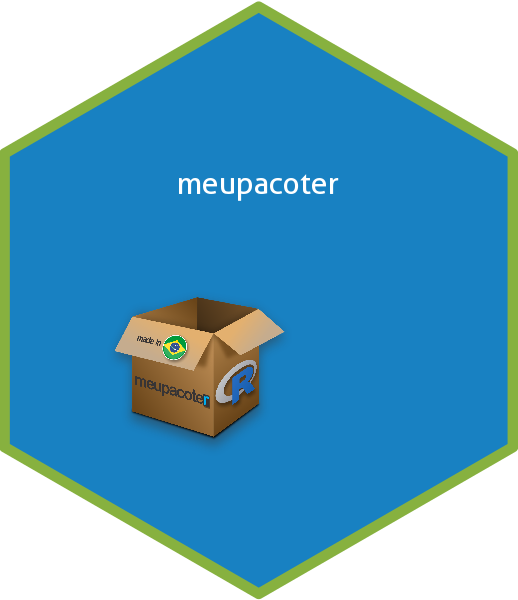
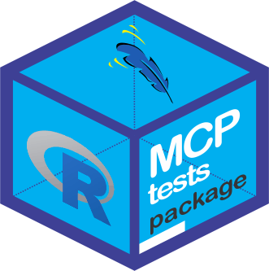

```{r, include = FALSE}
knitr::opts_chunk$set(
  collapse = TRUE,
  comment = "#>"
)
```

Todo esse material é baseado em três referências, que recomendamos a todos:

* [Writing R Extensions](https://cran.r-project.org/doc/manuals/r-devel/R-exts.html#Creating-R-packages)
* [R packages](https://r-pkgs.org/index.html)
* [Advanced R](https://adv-r.hadley.nz/)

Acreditamos que a linguagem [R](http://r-project.org), conseguiu caminhar com suas próprias pernas, devido a versatilidade e contribuição computacional estatística para ciência. Hoje as áreas de atuação da linguagem são aplicadas nas mais diversas áreas do conhecimento. 

Entretanto, cremos que a facilidade de utilização dessa linguagem, exitem dois marcos, um antes e outro depois de [Hadley Wickham](http://hadley.nz/), o Cientista Chefe do [RStudio](http://rstudio.com), que por sinal, os dois livros citados acima ele faz parte. Entendemos, que alguns programadores não optem pela utilização de interfaces gráficas ao usuário [R](http://r-project.org), como o [RStudio](http://rstudio.com), as famosas *GUI*. Mas é notório que os recursos de alguns pacotes, inclusive desenvolvidos pelo próprio [Hadley Wickham](http://hadley.nz/), auxiliados com os recursos do [RStudio](http://rstudio.com), nos economiza um bom tempo de como programar ou desenvolver determinadas atividades. Dessa forma, podemos tornar o nosso tempo de trabalho mais eficiente. 

Um exemplo referente a esse assunto é a criação de uma *Website* para o pacote. Mesmo usuários da linguagem [R](http://r-project.org) que não tem afinidades com o desenvolvimento de páginas *Web*, podem dessenvolver a sua com o auxílio de um pacote chamado [pkgdown](pkgdown.r-lib.org). Iremos observar que em um passe de mágica, usando o [RStudio](http://rstudio.com), poderemos não só criar uma página para o pacote, mas também disponíbilizá-lo em um repositório do [GitHub](https://github.com), por exemplo. Claro que, à medida que vamos necessitando de algo mais complexo, haverá um maior esforço em estudar um pouco mais sobre o assunto, para atingir o objetivo desejado. Mais a frente, falaremos sobre como desenvolver uma *Website* para o seu pacote.

Por fim, há uma carência de materiais, em Português, que nos permita consultar sobre desenvolvimento de pacotes em [R](http://r-project.org), e consiga mostrar desde a parte introdutória até a avançada, assim como também a experiência de problemas solucionados que ainda geram dúvidas sobre esse assunto. Dessa forma, isso motivou a criação desse material. Esperamos, que você leitor, também possa fazer parte dessa contribuição, trazendo também as suas experiências, para que possamos acrescentar a esse material.

## Escolha do nome e logo do pacote {#name_logo_pkg}

Quando pensamos em desenvolver um pacote, temos a impressão que o conjunto de rotinas criadas auxiliará de alguma forma na solução de muitos problemas, sejam estes dos mais diversos possíveis. E esse pacote pode ter uma relevância muito importante, para diversas áreas.

O que falta ao nosso olhar, em muitos pacotes sobre o [CRAN](CRAN.r-project.org/), é a publicidade para aumentar o alcance da acessibilidade para os usuários. esse comportamento, vem mudando há um tempo. Percebemos que repositórios de códigos como o [GitHub](https://github.com/), [Gitlab](https://about.gitlab.com/), dentre outros, estão auxiliando muito bem essa publicidade, uma vez que esses repositórios permitem a hospedagem de *websites* para apresentação do pacotes, tutoriais, *bugs*, e muito mais. Isso proporciona tanto uma melhor apresentação quanto um maior engajamento dos usuários na contribuição e melhoria do pacote.

Mais a frente, exploraremos melhor esse tema. De início, iremos apresentar o cartão de visitas do pacote, que é o nome e a logo para a sua identificação. 

Visitando o manual do R, [Writing R Extensions](https://cran.r-project.org/doc/manuals/r-devel/R-exts.html#Creating-R-packages), a recomendação é

<blockquote>
  <p>
    <em>
O campo obrigatório ‘Package’ [como um dos itens no arquivo *DESCRIPTION* do pacote] fornece o nome do pacote. Deve conter apenas letras (ASCII), números e ponto, ter pelo menos dois caracteres e começar com uma letra e não terminar com um ponto.
    </em>
  </p>
</blockquote>
<!--
<blockquote>
  <p>
    <em>
      The mandatory ‘Package’ field gives the name of the package. This should contain only (ASCII) letters, numbers and dot, have at least two characters and start with a letter and not end in a dot.
    </em>
  </p>
</blockquote>
-->

Percebemos que as recomendações são bem simples. Contudi, no livro [R Packages](https://r-pkgs.org/description.html), [Hadley Wickham](http://hadley.nz/) e [Jenny Bryan](https://jennybryan.org/) apresentam algumas recomendações pragmáticas, que consideramos pertinentes. Inclusive é um puxão de orelha aos meus pacotes desenvolvidos. Apresentamos aqui alguns desses comentários:

* Escolha um nome exclusivo que seja fácil para o Google, isto é, para que is usuários encontrem mais facilmente;
* Não escolher um nome que já esteja em uso no [CRAN](http://cran.r-project.org), uma vez que se desejar submeter o seu pacote, certamente, será rejeitado, e vale a pena também se perguntar:
  * Há um pacote em desenvolvimento, por exemplo, no [GitHub](https://github.com/) que já tem algum histórico e parece estar caminhando para a publicação?
  * Este nome já é usado por outro software ou por uma biblioteca ou estrutura, por exemplo, nas linguagens [Python](https://www.python.org/) ou [JavaScript](https://www.javascript.com/)?
* Evite letra maiúsculas e minúsculas. Isso porque pode dificultar encontrar o pacote e ainda mais difícil de se lembrar;
* Dê preferência a nomes pronunciáveis, para que as pessoas se sintam confortáveis ao falar sobre seu pacote e tenham uma maneira de ouvi-lo dentro de suas cabeças.
* Algumas criações sobre nomes de pacotes foram discutidas no post de Nick Tierney, [Naming Things](https://www.njtierney.com/post/2018/06/20/naming-things/), bem interessante a discussão.


Claro que atender a todos esses itens é impossível, simultaneamente. Por exemplo, no início da criação de meus pacotes, passei por alguns conflitos pessoais e profissionais sobre a escolha do nome dos pacotes, porque tomar essa decisão, é algo que nos atormenta no processo de desenvolvimento. E de fato, em algumas dessas criações fizemos misturas de letras maiúsculas e minúsculas. Percebemos, que a lembrança do nome para os usuários, bem como digitá-lo, acaba dificultando um pouco. Após essa decisão, acaba sendo um processo irreversível, pois a alteração do nome do pacote, uma vez publicada no CRAN, nunca mais será modificada. Ao criar um pacote para procedimentos de comparações múltiplas, de início pensamos no nome **MCP**. Contudo, já existia um pacote chamado [mcp](https://lindeloev.github.io/mcp/) no [CRAN](http://cran.r-project.org), com outra finalidade, e apesar de está com letra minúscula, a minha sugestão inicial foi rejeitada pelo [CRAN](http://cran.r-project.org). Isso acabou me levando a tentação de intitulá-lo [MCPtests](https://github.com/bendeivide/MCPtests), um nome não sugerido pelos conselhos anteriores. A explicação é bem simples, quando estamos em fase de submissão do pacote ao [CRAN](http://cran.r-project.org), recebemos quase sempre muitas voltas para correções do pacote. E daí, nos preocupamos em alguns problemas complexos para a aceitação do pacote, que passamos despercebido em outros tão importantes quanto, como por exemplo o nome do pacote. Por fim, o anseio ao receber a aceitação do pacote ao [CRAN](http://cran.r-project.org), me fez cair na tentação do nome escolhido para o [MCPtests](https://github.com/bendeivide/MCPtests). Assim, também acabou ocorrendo com outro pacote chamado [midrangeMCP](https://github.com/bendeivide/midrangeMCP). Assim, pense um pouco mais sobre os conselhos apresentados anteriormente e que essa nossa experiência também sirva de experiência para você, leitor, sobre a escolha do nome do seu pacote.

Na época da escolha dos nomes dos pacotes comantados anterioremnte, ainda não conhecíamos um pacote chamado [available](https://github.com/r-lib/available). Este pacote auxilia a verificar se já existe o nome desejado em algumas plataformas. Por exemplo, o pacote guia para esse material, será chamado de [meupacoter](https://bendeivide.github.io/meupacoter/). Vejamos se já existe algum pacote com esse nome:
```{r, eval = FALSE}
available::available("meupacoter")
#> Warning: package 'tidytext' was built under R version 3.6.3
#> -- meupacoter ----------------------------------------------------------------
#> Name valid: (OK)
#> Available on CRAN: (OK)
#> Available on Bioconductor: (OK)
#> Available on GitHub:  (NO)
#> Abbreviations: http://www.abbreviations.com/meupacoter
#> Wikipedia: https://en.wikipedia.org/wiki/meupacoter
#> Wiktionary: https://en.wiktionary.org/wiki/meupacoter
#> Urban Dictionary:
#>   Not found.
```
Perceba que pelo [GitHub](https://github.com/) o nome apresentou um problema, porque já existe um diretório dele nesse repositório. 

Um outro caminho, pode ser baseado no título do pacote. Por exemplo, [meupacoter](https://bendeivide.github.io/meupacoter/) tem como título "Como desenvolver meu primeiro pacote R". Vamos pedir uma sugestão de nome de pacote para o pacote [available](https://github.com/r-lib/available),

```{r, eval = FALSE}
available::suggest("Como desenvolver meu primeiro pacote R")
#> pacoter
```

Apesar da sugestão, resolvemos ficar com o nome já adotado. Acho que por aí, nós poderemos dá um passo inicial. Uma vez escolhido o nome do pacote, passamos para a criação da logo. Percebemos, uma tendência dos pacotes em R terem sempre um fundo de forma hexagonal. Isso não é um padrão. Contudo, pensando nesse formato, mais um pacote para nos auxiliar nesta criação, chamado [hexSticker](https://github.com/GuangchuangYu/hexSticker). Temos a função `sticker` com os argumentos principais `package` e `subplot`, sendo o nome do pacote e a imagem para inserir no fundo hexagonal, respectivamente. Existem mais argumentos, com mais opções de alterações na imagem, tais como bordas, fonte, cores, posicionamento de texto e imagem, dentre outras. Apesar de já termos a logo de [meupacoter](https://bendeivide.github.io/meupacoter/), vamos apresentar como criar essa imagem, usando as seguintes linhas de comando:

```{r logo}
logomeupac <- "E:/BEN_R/pkgs_building/meupacoter/man/figures/logo.png"
hexSticker::sticker(subplot = logomeupac, package = "meupacoter", filename = "E:/BEN_R/pkgs_building/meupacoter/man/figures/logoteste.png")
```

O resultado foi essa logo a seguir. Claro, que precisaríamos melhorar algumas configurações

{width=30%}

Apesar dessas facilidades, percebemos que isso é algo bem pessoal para o desenvolvedor, porque de fato, você acaba deixando um pouco de sua criatividade e isso não pode ser um padrão. Vejam algumas logos de nossos pacotes:

 {width=30%} 


## Boas práticas para a escrita de um código R {#goodpractice}

<!--
Ensinar o que cada pacote faz e como executá-los!

Pacotes a estudar:
- goodpractice => goodpractice::gp
- formatR (Ver Advaced R, 1ed, cap 5)
- styler > RStudio > Addins > Style active package (todo o pacote)
- styler > RStudio > Addins > Style active file (Uma função selecionada)

- lintr

https://google.github.io/styleguide/Rguide.html
https://style.tidyverse.org/

Outra forma é configurar o RStudio para o propósito!
-->

As boas práticas de um código, se refere a forma de como você escreve seu algoritmo em [R](http:://r-project.org). Lembre-se que seu código poderá ser lido por muitos outros desenvolvedores. Dessa forma, seguem algumas sugestões de leituras:

* [https://google.github.io/styleguide/Rguide.html](https://google.github.io/styleguide/Rguide.html)
* [https://style.tidyverse.org/](https://style.tidyverse.org/)
* [Advanced R](http://adv-r.had.co.nz/Style.html)

Para auxiliar nessa jornada, seguem algumas sugestões de pacotes:

* [formatR](https://yihui.org/formatr/)
* [goodpractice](http://mangothecat.github.io/goodpractice/)
* [styler](https://styler.r-lib.org/)
* [lintr](https://cran.r-project.org/web/packages/lintr/readme/README.html)


## Boas práticas para a escrita de um pacote

<!--
Depois comentar cada uma delas mostrando o seu objetivo
-->

* Sempre atualize a versão e a identifique adequadamente;
* Crie um arquivo *NEWS*, e comente suas atualizações. Linha de comando `usethis::use_news_md()`;
* Crie um arquivo *README*, para auxiliar nas ideias básicas para o pacote e auxiliar no repositório [Github](https://github.com). Linha de comando `usethis::use_readme_rmd`;
* Use os repositórios do tipo Git, de preferência o [GitHub](https://github.com). As contribuições são imensas para o pacote
* Mantenha sempre a data do pacote atualizada;
* Escreva vignettes. Linha de comando `use_vignette("<nome_vignette>")`;
* Se possível, crie uma *Website* para o pacote. Linha de comando `pkgdown::build_site()`;
* internacionalize seu pacote;
* [Sempre comente seu código](introd_pkg.html#goodpractice), para que em futuras atualizações outros contribuídores do pacote tenham noção do que foi feito.


## Resumo do que vimos nessa seção

Em construção...

